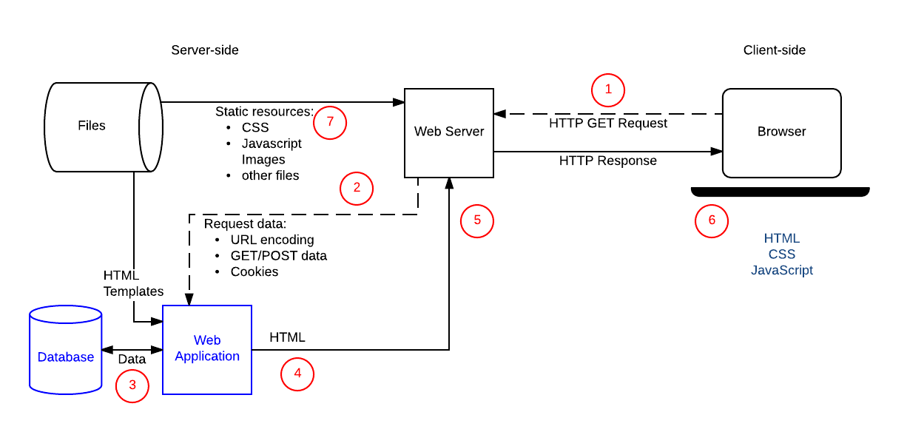

# This is the README.md file [assignment](https://pestotech.teachable.com/courses/1782350/lectures/40231525) by [Pesto Tech](https://www.pesto.tech/become-a-developer/)

## Table of Contents:
* When a user enters an URL in the browser, how does the browser fetch the desired result? Explain this with the below in mind and Demonstrate this by drawing a diagramfor the same.
  * a. What is the main functionality of the browser?
  * b. High Level Components of a browser.
  * c. Rendering engine and its use.
  * d. Parsers (HTML, CSS, etc).
  * e. Script Processors.
  * f. Tree constructiong.
  * g. Order of script processingh.
  * h. Layout and Painting.

## Q. When a user enters an URL in the browser, how does the browser fetch the desired result?
#### A. **Steps for what happens when we enter a URL:**
Browser checks cache for DNS entry to find the corresponding IP address of website.

1. It looks for following cache. If not found in one, then continues checking to the next until found.
    * Browser Cache
    * Operating Systems Cache
    * Router Cache
    * ISP Cache

2. If not found in cache, ISP’s (Internet Service Provider) DNS server initiates a DNS query to find IP address of server that hosts the domain name. 
The requests are sent using small data packets that contain information content of request and IP address it is destined for.
3. Browser initiates a TCP (Transfer Control Protocol) connection with the server using synchronize(SYN) and acknowledge(ACK) messages.
4. Browser sends an HTTP request to the web server. GET or POST request.
5. Server on the host computer handles that request and sends back a response. It assembles a response in some format like JSON, XML and HTML.
6. Server sends out an HTTP response along with the status of response.
7. Browser displays HTML content.
8. Finally, Done.

Refer below diagram for more understanding:

## a). What is the main functionality of the browser?
### Interpret HTML
_The main function is to retrieve information from the World Wide Web and making it available for users. Visiting any website can be done using a web browser._

Refer below diagram for more understanding:

## b). High Level Components of a browser
**Components of a Web Browser:**

1. **User Interface** 
It is an environment allowing users to use certain features like search bar, refresh button, menu, bookmarks, etc.

2. **Browser Engine** 
The bridge connects the interface and the engine. It monitors the rendition engine while manipulating the inputs coming from multiple user interfaces.

3. **Networking** 
The protocol provides an URL and manages all sorts of safety, privacy and communication.
In addition, the store network traffic gets saved in retrieved documents.

4. **Data Storage** 
The cookies store information as the data store is an uniform layer that the browsers use. Storage processes like IndexedDB, WebSQL, localStorage, etc works well on browsers.

5. **JavaScript Interpreter** 
It allows conversion of JavaScript code in a document and the executes it. Then the engine shows the translation on the screen to the users.

Refer below diagram for more understanding:

## c). Rendering engine and its use
A rendering engine is software that draws text and images on the screen. The engine draws structured text from a document (often HTML), and formats it properly based on the given style declarations (often given in CSS). Examples of layout engines: Blink, Gecko, EdgeHTML, WebKit.

Refer below diagram for more understanding:

## d). Parsers (HTML, CSS, etc)
**TLDR;**
* Parsing and Rendering turn the HTML content into a web page with colors and backgrounds and pictures.
* **HTML Parsing:** HTML Text -> Tokenization -> DOM Tree
* **CSS Parsing:** CSS Text -> Tokenization -> CSSOM Tree
* DOM and CSSOM are merged to form a Render Tree
* Render Tree has all the information required to mark and paint the screen.
* Render Tree -> Layout -> Paint
* The layout does the maths for placing the elements
* Paint paints the elements with colors, backgrounds, shadows, etc.

HTML Parsing:

CSS Parsing:

Rendering of Web Page:

## e). Script Processors
The Script processor allows you to specify your own processor logic for a simple processor using JavaScript or Groovy. The script is entered as an option on the script processor.

## f). Tree construction
**TLDR;**
* The DOM and CSSOM trees are combined to form the render tree.
* Render tree contains only the nodes required to render the page.
* Layout computes the exact position and size of each object.
* The last step is paint, which takes in the final render tree and renders the pixels to the screen.

Refer below diagram for more understanding:

## g). Order of script processing
Designing your web page using JavaScript requires attention to the order in which your code appears and whether you are encapsulating code into functions or objects, all of which impact the order in which the code runs.

## h). Layout and Painting
**Layout:** 
The layout (also called reflow) peace will be in charge to calculate the positions and dimensions of each node on the screen. For instance, if you rotate your phone, or if you resize your browser, the layout peace will be executed.

Let’s take a look another example related to layout:

**Paint:** 
Finally, now that we know which nodes are visible, and their computed styles and geometry, we can pass this information to the final stage, which converts each node in the render tree to actual pixels on the screen. This step is often referred to as “painting”, “rasterizing.” or “repainting”.

#### Note
  * I do not own any copyrights, all the rights go to their respective owners. Thank You. :smiley: